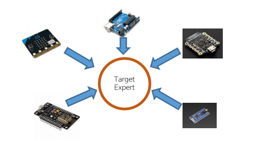

# TargetExpert

TargetExpert 프로젝트는 Target Machine(※ MCU)의 Firmware를 각각의 Target Machine 별로 만들어야 하는 불편함을
제거하기 위한 Project입니다.
이는 Low-level Layer(이하 LLL), Middle-Level Layer(이하 MLL), High-Level Layer(이하 HLL)로 구성된 총 3단계의
Layer 구성으로, LLL에서 거의 공통된 Function 또는 Class Name을 가진 API로 각각의 Target Machine을 별도로
구성한 후, MLL로 완전히 공통된 Function 또는 Class Name으로 통합하여 마치 아두이노와 같은 기능을
할 수 있도록 API화 시킨 임베디드용 Framework입니다.

### MCU Firmware의 개발은 전자공학 및 컴퓨터공학의 전 지식이 혼합되어서 개발해야 하므로 난이도가 매우 높은 작업.
### 이를 조금이라도 줄이기 위해 Arduino 같은 Library Package 및 Hardware가 나왔으나 모든 기능에 대한 제어가 사실상 힘들다.
### 결정적으로 이를 다루는 사용자는 현실적인 요구사항에 맞춰 Industry Level의 개발은 불가함.
### 결론적으로 Maker 및 Prototyper는 이러한 “기술적 난이도”가 매우 높아 실제 팔 수 있는 물건을 내놓기가 쉽지 않음.
### Maker가 Industry Level의 “순조로운 이동”을 도울 수 있도록 기술적 난이도를 “매우” 낮추고 MCU의 모든 기능에 대한 제어를 매우 쉽게 할 수 있도록 함.

현재는 많은 부분이 자동화가 되어 첫째 시간에 실습하기 위해 준비한 만큼의 시간은 필요하지 않음.
WindowsOS는 아직 미지원. 리눅스 기반 OS에서 작동 가능
